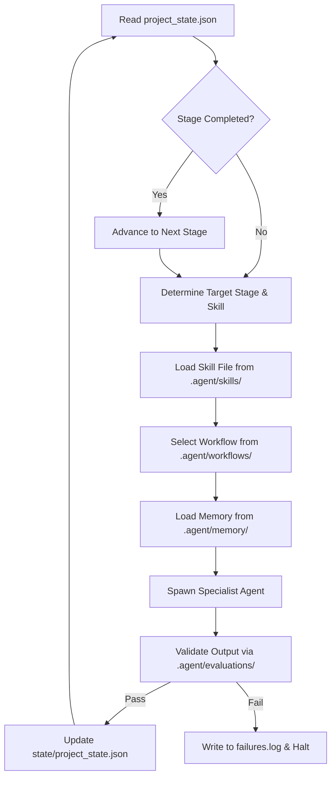

# Griptix Agentic Orchestrator (`ORCH`)

The Orchestrator (`ORCH`) is the master agent responsible for managing the Griptix build lifecycle. It governs specialist agents (Backend, Frontend, UI, Schema, QA, etc.) using a set of strict, rule-based sequential gates and checks.

---

## 📋 Universal Rules

1. **Gate Transitions**: An agent is never spawned for a stage/cycle until every checklist item of the predecessor stage is marked complete inside `.agent/state/project_state.json`.
2. **Parallel Operations**: Parallel execution is only allowed if there are no shared file dependencies (e.g., `SCHEMA` design and `UI` token scaffolding can run in parallel in Cycle 0, but `FRONTEND` is blocked until both catalog endpoints and core UI components are delivered).
3. **Failure Isolation**: If any task fails (lint checks, strict typing, tests, builds), `ORCH` halts downstream agents, outputs the trace to `failures.log`, and alerts the supervisor.
4. **Scope Control**: If an agent attempts to write code outside its allowed directory (e.g., `UI` writing DB queries), the output is rejected.
5. **Secrets Handling**: All secrets must be loaded from Doppler (development) or Railway/Render environment variable settings (production). Hardcoded secrets in any output will trigger immediate rejection and validation failures.
6. **Definition of Done**: A checklist item is marked completed only when its automated evaluations (in `.agent/evaluations/`) pass.

---

## 🔄 The Orchestration Loop

---

## 🛡️ Specialist Scope Boundaries

| Agent ID | Allowed Paths | Forbidden Paths | Verification Command |
| --- | --- | --- | --- |
| `INFRA` | `/infra`, `docker-compose.yml`, `package.json`, `railway.json` | `/apps`, `/packages` | `railway status` / Docker checks |
| `SCHEMA` | `/apps/api/models`, `/apps/api/schemas`, `alembic/` | `/apps/web`, `/packages/ui` | `alembic current` / `mypy` |
| `BACKEND`| `/apps/api/routers`, `/apps/api/services` | `/apps/web`, `/packages/ui` | `pytest` / `mypy` |
| `UI` | `/packages/ui` | `/apps/api`, `/apps/web` | `tsc --noEmit` / Storybook build |
| `FRONTEND`| `/apps/web/pages`, `/apps/web/components` | `/apps/api`, `/packages/ui` | `next build` / `tsc --noEmit` |
| `QA` | `*` (Read-only) | Any write operations | Running Jest/Pytest/Lighthouse |
