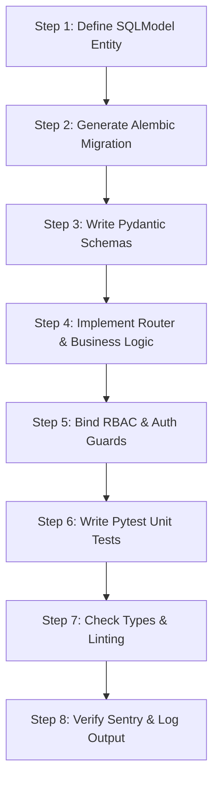

# WORKFLOW: Backend Build & Endpoint Creation

This workflow defines the standard execution steps for creating PostgreSQL database models, setting up migrations, and implementing API routes in FastAPI.

---

## 📅 Flow Chart

---

## 📋 Step Details

### Step 1: SQLModel Definition
- Load `.agent/skills/stage3_database.md` (or `.agent/skills/stage5_payments.md`).
- Define database entity in `apps/api/models/`. Enforce UUID primary keys, default timestamps, and explicit constraints.

### Step 2: Database Migration
- Run: `alembic revision --autogenerate -m "description"`
- Review migration code. Run `alembic upgrade head`.

### Step 3: Pydantic Schema Exports
- Create validation schemas (`Create`, `Read`, `Update`) in `apps/api/schemas/`.
- Export openapi specs to `packages/types/` for frontend synchronization.

### Step 4: Router & Services
- Implement FastAPI routes inside `apps/api/routers/`. Include pagination, query filters, and error handlers.
- Offload heavy operations (presigned URLs, payment verification, emails) into background tasks.

### Step 5: Auth & RBAC
- Guard routes with `Depends(require_role(Role.ATHLETE))` or `Role.ADMIN` security dependencies.

### Step 6: Testing
- Write Pytest scripts inside `apps/api/tests/`. Mock database sessions and external services. Target >= 70% coverage.

### Step 7: Lints & Types
- Run `ruff check apps/api` and `mypy apps/api` to verify linting and strict typing.

### Step 8: Logging
- Verify Sentry catches exceptions and structured JSON requests log inside CloudWatch/Logtail.
