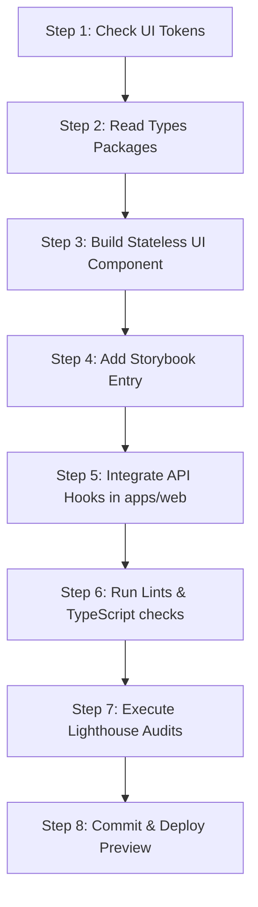

# WORKFLOW: Frontend Build & Integrate

This workflow defines the standard execution steps for compiling and verifying UI pages and components on the Griptix Next.js frontend.

---

## 📅 Flow Chart

---

## 📋 Step Details

### Step 1: Load Skill & Memory
- Determine if the page or component is a storefront core piece. Load `.agent/skills/stage4_frontend.md` (or `.agent/skills/stage2_design_system.md`).
- Load `.agent/memory/branding.json` for color standards and fonts.

### Step 2: Read Types Packages
- Inspect packages/types to ensure API schemas are fully typed and available.

### Step 3: Scaffold stateless UI component
- Build inside `packages/ui` first. Ensure all color/border/size tokens pull from CSS variables, never hardcoded hexes.
- Implement responsive viewport scaling.

### Step 4: Storybook Documentation
- Write Storybook files (`*.stories.tsx`) covering light/dark themes and active/loading/disabled states.

### Step 5: Integrate API hooks in apps/web
- Write Page file inside `apps/web/pages/` or components. Bind React state or global stores (Zustand) and connect backend API routes.

### Step 6: Verification
- Execute lint checks: `pnpm run lint:web` / `pnpm run lint:ui`.
- Run typechecks: `pnpm run typecheck:web` / `pnpm run typecheck:ui`.

### Step 7: Local Benchmarks
- Run Lighthouse audits against the page. Verify mobile accessibility and fast LCP.

### Step 8: Commit
- Commit code to the workspace. Ensure all pre-commit hooks pass.
