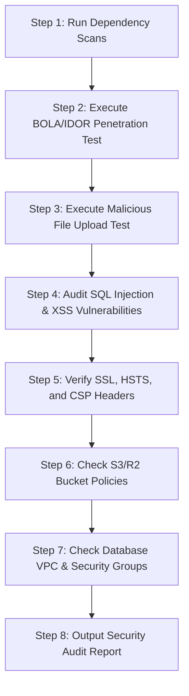

# WORKFLOW: Security Audit & Penetration Tests

This workflow defines the standard verification steps for auditing the Griptix monorepo for security vulnerabilities, access control flaws, and data exposure.

---

## 📅 Flow Chart

---

## 📋 Step Details

### Step 1: Dependency Scans
- Run `npm audit` inside the root directory. Patch any packages with high or critical severity alerts.
- Run `pip-audit` inside `apps/api/`. Fix Python packages containing vulnerabilities.

### Step 2: BOLA / IDOR Verification
- Spawn QA test: Verify that request headers containing an Athlete A JWT token attempting to fetch `GET /api/v1/orders/{order_id_of_user_b}` receive a strict `HTTP 403 Forbidden` response.
- Repeat BOLA tests on anatomical profiles and user setting endpoints.

### Step 3: Malicious File Upload Check
- Attempt to upload an executable script (e.g. `.sh`, `.py`, `.php`, `.exe`) using `POST /profiles/{id}/upload-scan` or `confirm-scan`.
- Ensure MIME-type validations reject non-image file uploads immediately.

### Step 4: SQL Injection & XSS
- Submit SQL command escapes (e.g., `' OR 1=1 --`) to search routes. Ensure the backend returns empty results, not stack traces or DB dumps.
- Send scripting payloads (e.g., ``) to text inputs. Ensure text is sanitized at database inserts.

### Step 5: Web Headers Config
- Test endpoints to ensure HSTS (`Strict-Transport-Security: max-age=31536000; includeSubDomains`) is present.
- Verify the Content-Security-Policy (CSP) headers block inline scripts (unless whitelisted).

### Step 6: Bucket Policies
- Verify that Cloudflare R2/S3 upload bucket policies block public reads, and require signed URLs for any object fetches.

### Step 7: DB Isolation
- Check Neon / Postgres network parameters. Ensure connections are rejected from non-secured tunnels and require SSL.
